# Bookstore 简单文档

Bookstore 是一个简单的书店 web 应用。它基于 Tomcat server, mysql 进行开发。
运用了 Servlet 及 JSP 技术，对大部分请求，她首先在 Servlet 中进行相应的处理
（包括数据库的交互），然后将结果设置在 request 的 Attribute 中，转发给相应的
JSP 进行结果呈现，以简陋的方式实现了数据处理与呈现之间的解耦。本应用与数据库的
交互是通过 JDBC 直接实现。

## 部署配置

### jar
本应用依赖的 jar 有:

* [gson-2.6.2.jar](https://github.com/google/gson) (json解析库，
负责应用内json解析)
* mysql-connector-java-5.1.38-bin.jar (数据库驱动，好像版本不对可能出问题)

这些 jar 按作业要求没有包含，需要先安装。

### 数据库

本应用需要数据库支持，请先用 src 下的 init.sql 初始化好数据库（包含一些初始数据）
然后在 web/META-INF/context.xml 根据自己的设置配好 Datasource.

## 功能简介

### 用户注册、登录与登出

对于未登录用户，页面右上角有注册与登录按钮，点击即可进入相应功能。（注册仅可注册普通用户）

登录后，右上角变为用户名，点击可显示功能菜单。

普通用户(测试帐号:user 密码:test): 

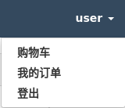

管理员(测试帐号:root 密码:12345678):

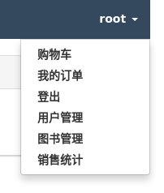

点击登出，即可登出。

### 用户管理功能

管理员登录后，点击功能菜单中的用户管理，即可进入用户管理模块。

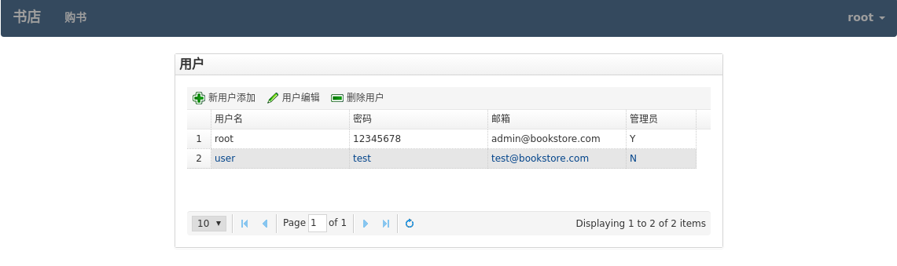

可以进行用户的增删改查。

### 图书管理功能

管理员登录后，点击功能菜单中的图书管理，即可进入图书管理模块。

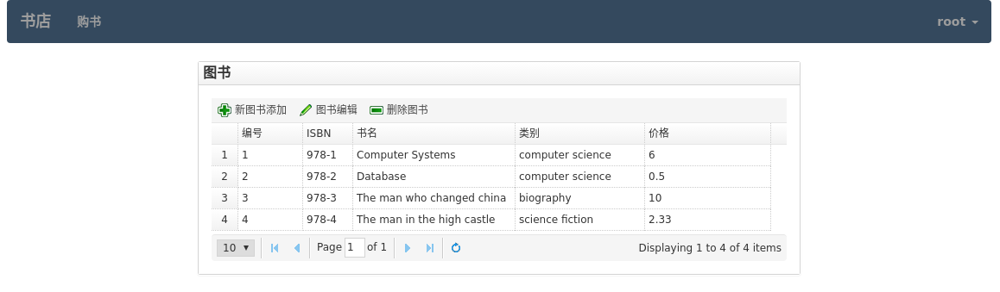

可以进行图书的增删改查。

### 图书购买功能

用户点击左上角“购书”可进入书籍列表界面：

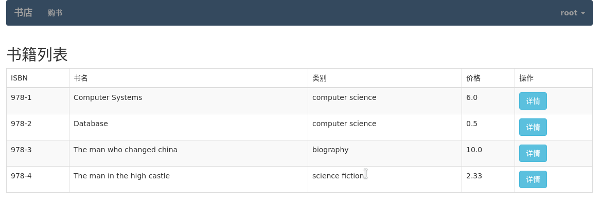

对感兴趣的书籍可以点击详情按钮，查看其详情。详情页中，可以填写要购买的数量。
点击“加入购物车”即可加入购物车并返回列表页面，继续购买。

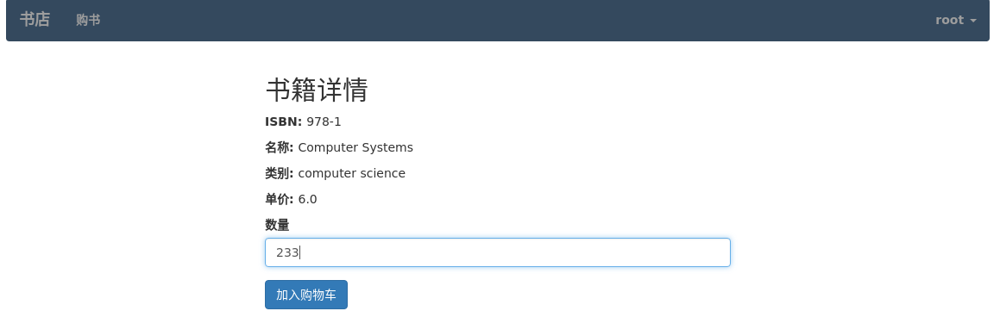

所有要买的书都添加完后，可以点击功能菜单中的购物车，查看自己购物车中的物品。
对数量进行最后的修改(不要的商品数量可以填0)，点击“提交订单”即可创建订单。

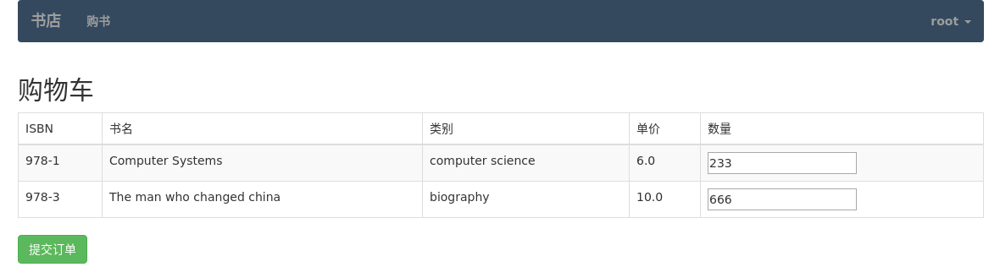

订单创建成功，可以立即支付。

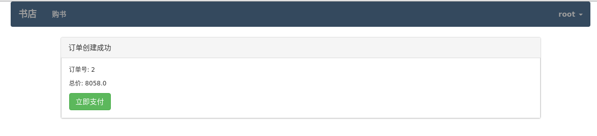

也可暂不支付，稍后在“我的订单”中支付。

### 我的订单

用户点击功能菜单中“我的订单”，即可进入自己订单的管理。

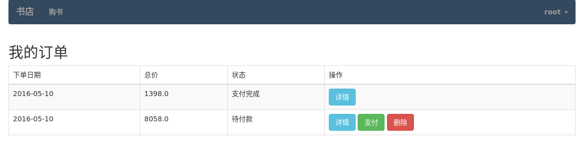

这里可以对尚未支付的订单进行支付，也可删除尚未支付的订单，然而已付款订单是不能删除的，
必须留下记录。

### 销售统计功能

管理员登录后，点击功能菜单中的销售统计，即可进入销售统计页面。页面分为三部分：
按用户查询、分类销售量和销售量时间关系图。

按用户查询中，输入用户名即可查看该用户的订单。

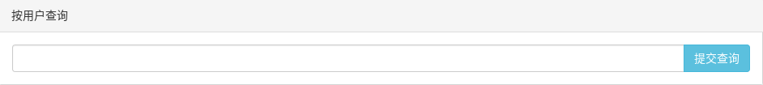

可以看到用户订单总数及总金额的统计（这里包括所有订单，包括暂未付款的）。
对暂未付款的订单还可以以管理员权限删除。

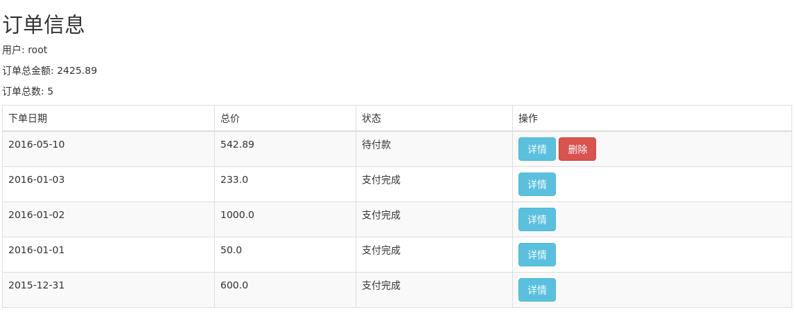

分类销售量将每类的销售额以饼图进行可视化（只统计已支付的订单）

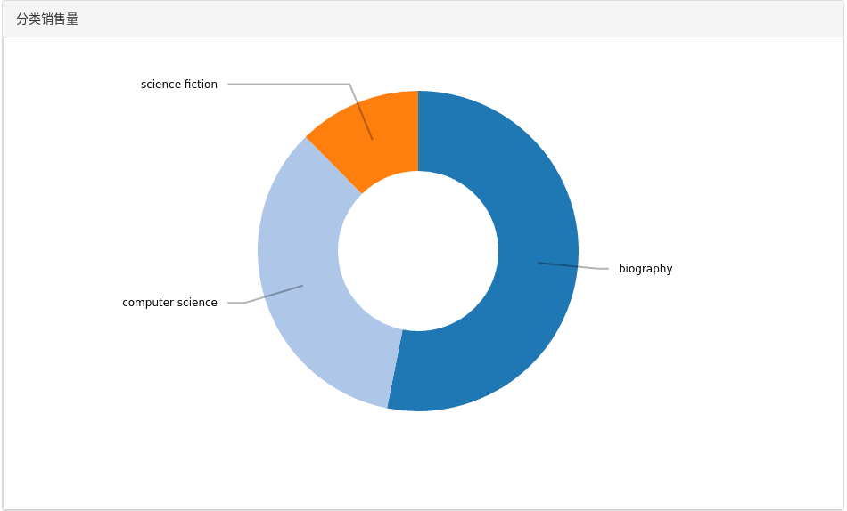

销售量时间关系图刻画销售量随时间的变化，左上角三个按钮可切换统计的粒度。

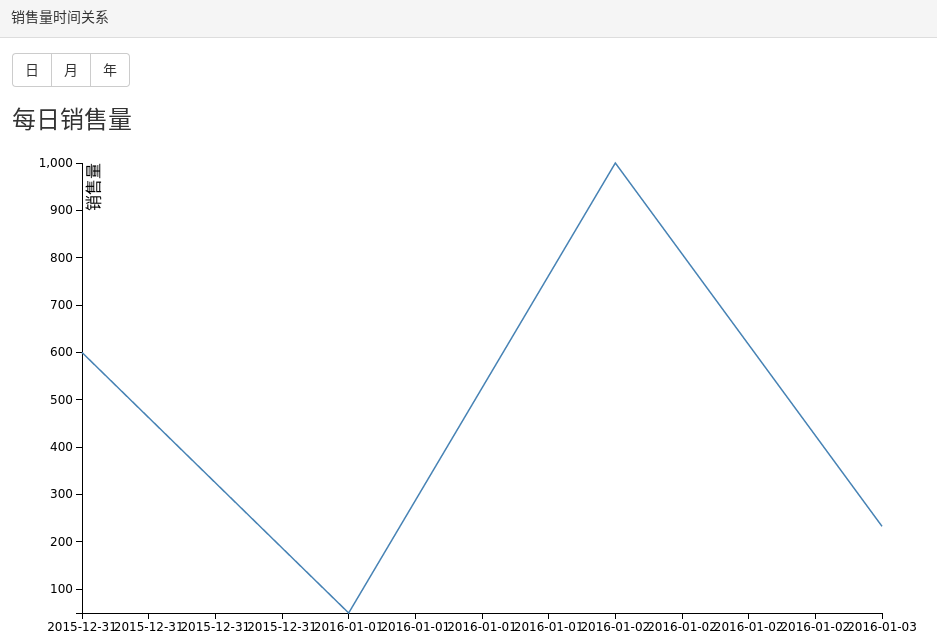

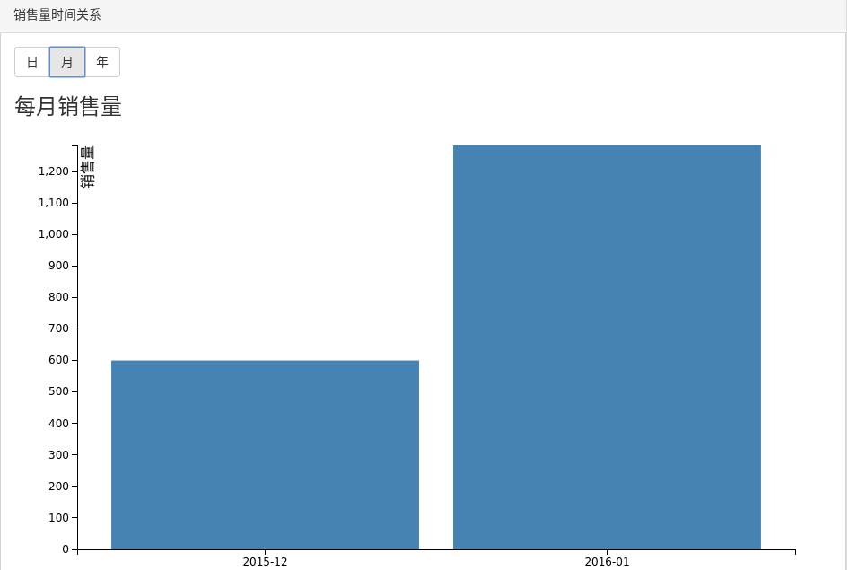

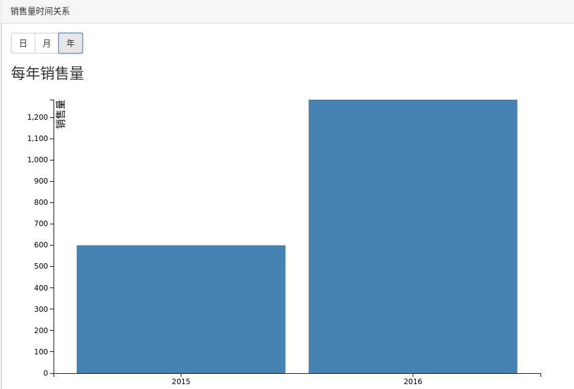

## 代码结构

代码分为后台处理与前台呈现两部分。后台处理位于 src 文件夹下，主要为 Servlet.
按功能分为 auth, book, order, shopping, stat, user 六个包。
前台呈现位于 web 文件夹下, 为 JSP 及其他静态文件。

## 设计细节

当客户端请求到来时，首先要经过 filter 处理，因为所有页面都要在右上角显示登录的用户名，
因此都需要访问 session 取出当前登陆的用户，此部分功能在 UserFilter 中统一处理。
此外，AdminFilter 负责对管理员区域访问的权限验证，LoginFilter 负责对登陆后才可访问的页面的权限验证。

此后，请求经过相应 Servlet 处理（包括与数据库的交互），产生结果，转发给相应 JSP 进行数据呈现。
部分 JSP 不能直接使用，故位于 WEB-INF/view 文件夹下，防止用户的直接访问。

因为众多 Servlet 都要访问数据库，故抽象出父类 DBServlet, 对数据库的链接和关闭的代码进行复用。

购物车功能使用 session 实现，销售统计可视化使用 d3.js 实现。
